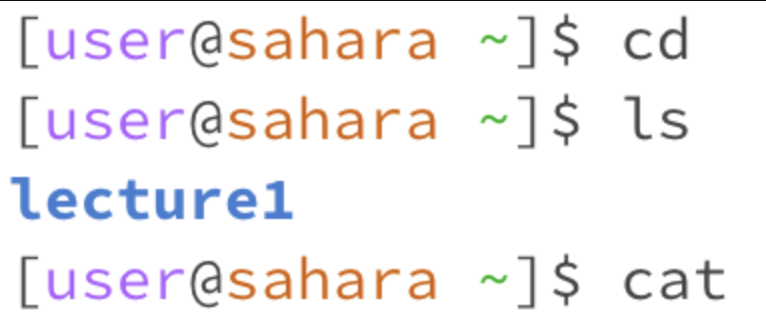
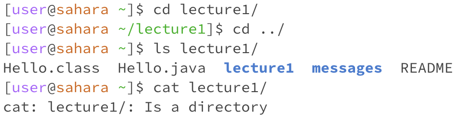
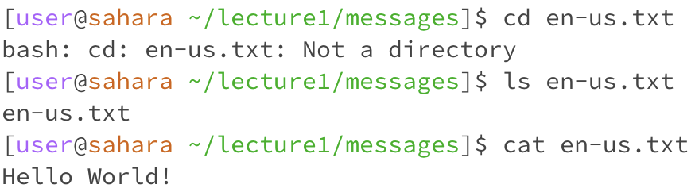

# **Lab Report 1**
[Link to Week 1](https://ucsd-cse15l-w24.github.io/index.html)
---
> `cd`, `ls`, and `cat` without arguments:

- `Cd`: Before the command was run, our working directory was the  home directory. Without arguments, nothing occurs when `cd` is used and we did not move directories.  Nothing changed because we didn't tell the command which directory to change to. The output is not an error as `cd` stayed in the home directory when it was given nothing as an argument.
- `Ls`: When using `ls`, `lecture1` is outputted. Since our working directory is the home directory, the only directory within it is `lecture1`. We did not change directories since the function of `ls` is to list the contents of directories. This output is not an error as `ls` listed the contents of the working directory.
- `Cat`: Our working directory is the home directory before we use `cat`. After using this command, we stay in the home directory, and since there were no arguments, it didn't output anything. The output is not an error as `cat` didn't output anything when it was given nothing as an argument.

>`cd`, `ls`, and `cat` with path to directory as an argument:

- `Cd`: Before the command was run, our working directory was the home directory. Using `cd` with `lecture1` as an argument, we're going from home to the `lecture1` directory. This was the correct output since `cd` is a command for directories and it was given a directory as an argument.
- `Ls`: Using `ls` with lecture1 as an argument lists all of the contents of the directory. Since we are now inside the `lecture1` directory, all contents of `lecture1` will be outputted. This directory specifically contains `Hello.class`, `Hello.java`, `lecture1`, `messages`, and `README`; all of these were printed so the output pictured was not an error.
- `Cat`: Before the command with the directory as an argument, our working directory was the home directory. After the command, we stayed in home directory and the output produces an error. We got this error because `cat` is used for files and the argument was a directory. 

>`cd`, `ls`, and `cat` with path to file as an argument:

- `Cd`: Before the command was used, our working directory was the `messages` directory. After the command was ran, we are still within the `messages` directory, however an error was outputted. Using `cd` with `en-us.txt` as an argument causes an error because `cd` is a command used for directories and `en-us.txt` is a file.
- `Ls`: Before the command was used with `en-us.txt` as an argument, our working directory was the `messages` directory. After the command was used, we stayed in the `messages` directory and `en-us.txt` was the output. `Ls` is meant to list the contents of directories so this output is not an error.
- `Cat`: Before the command was used, our working directory was the `messages` directory. We did not move directories after the command was done since `cat` only prints contents of files, but the correct output was produced. In this case, `Hello World!` were the only contents of `en-us.txt`, and was the output. 

