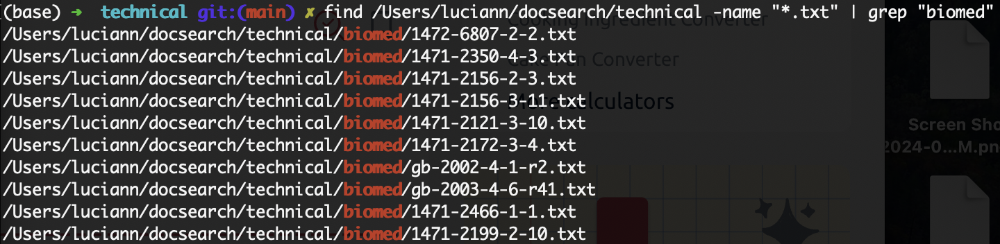
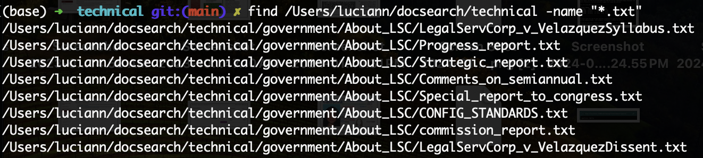
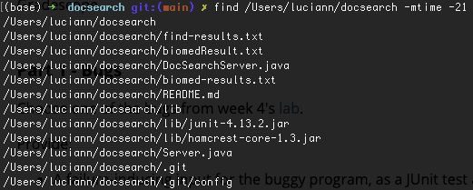
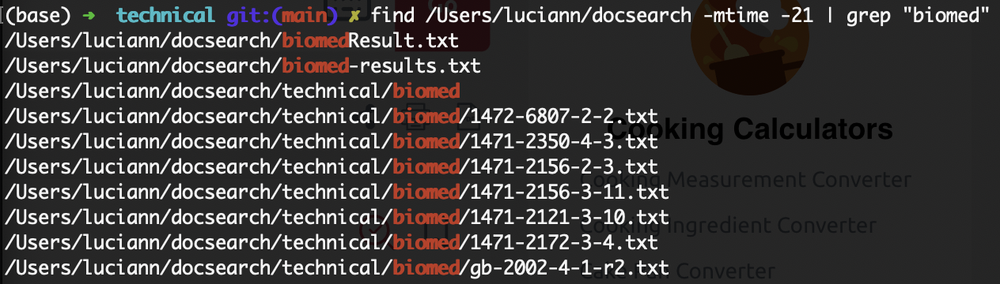
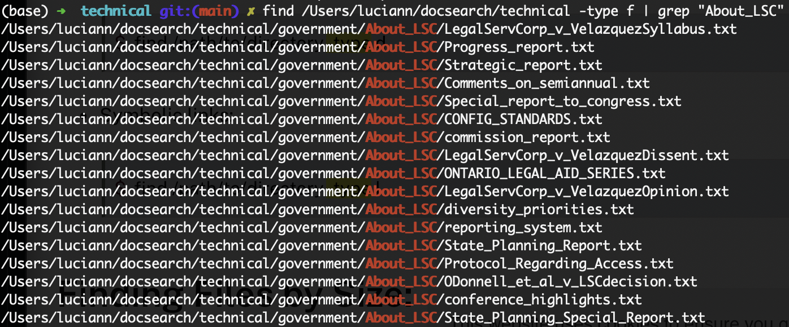
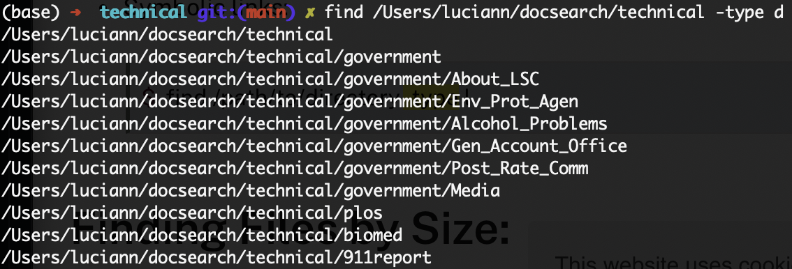
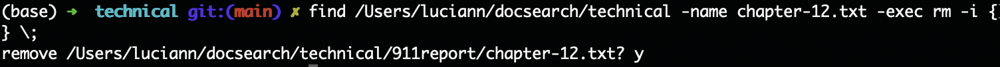
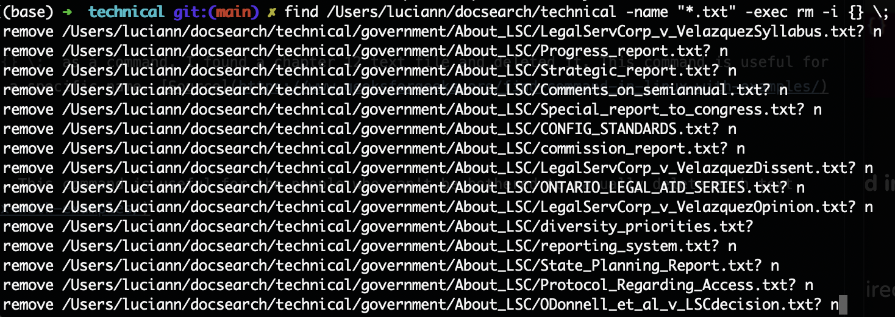

## Lab Report 3
### Part 1: Bugs

failure-inducing input:
```java
int[] input1 = {1, 2};
int[] input1_expected = {2, 1};
assertArrayEquals(input1_expected, ArrayExamples.reversed(input1));
```

input that doesn't induce failure:
```java
int[] input2 = {1, 2, 3, 4};
int[] input2_expected = {4, 3, 2, 1};
assertArrayEquals(input2_expected, ArrayExamples.reversed(input2));
```
The symptom as an output:


The Bug before:
```java
  static int[] reversed(int[] arr) {
    int[] newArray = new int[arr.length];
    for(int i = 0; i < arr.length; i += 1) {
      newArray[i] = arr[arr.length - i - 1];
      System.out.println(newArray[i]);
    }
    return arr;
  }
```

The Bug after:
```java
  static int[] reversed(int[] arr) {
    int[] newArray = new int[arr.length];
    for(int i = 0; i < arr.length; i += 1) {
      newArray[i] = arr[arr.length - i - 1];
      System.out.println(newArray[i]);
    }
    return newArray;
  }
```

Briefly describe why the fix addresses the issue:

Prior to fixing the bug, `reversed()` was returning the array that was being inputted. After changing what is being returned from `arr` to `newArray`, this method now returns a new array with the elements in reverse order.


### Part 2: Researching Commands
command-line options for `find`

> `find -name` : search for files by name or pattern [Source](https://tecadmin.net/linux-find-command-with-examples/)

 

Using `find /Users/luciann/docsearch/technical -name "*.txt" | grep "biomed"` as a command, I found all the text files in `./technical` that contained "biomed" in the path. This command is very useful to find files with specific names. ([Source for -name "*.txt"](https://kb.iu.edu/d/admm) , Source for grep: Week 5 Wednesday notes)

 

Using `find /Users/luciann/docsearch/technical -name "*.txt"` as a command, I found all the text files in `./technical`. This command is useful if there are other non-text files in the directory and I just want to see only text files. ([Source](https://kb.iu.edu/d/admm)).


>`find -mtime` : search for files based on the time they were modified [Source](https://tecadmin.net/linux-find-command-with-examples/)



Using `find /Users/luciann/docsearch -mtime -21` as a command, I found files that were modified within the last 21 days. This command would be useful to look for which files were updated within the last, in this case, 21 days. [Source](https://tecadmin.net/linux-find-command-with-examples/)



Using `find /Users/luciann/docsearch -mtime -21 | grep "biomed"` as a command, I found biomed text files that were modified within the last 21 days. This command is useful to find specific files that were modified within the last 21 days; in this case we are looking for text files that contain "biomed". ([Source for -mtime -21](https://kb.iu.edu/d/admm) , Source for grep: Week 5 Wednesday notes) [Source](https://tecadmin.net/linux-find-command-with-examples/) + week 5, wednesday notes
  
> `find -type` : Specifies whether to look for a file or directory [Source](https://www.geeksforgeeks.org/find-command-in-linux-with-examples/)



Using `find /Users/luciann/docsearch/technical -type f | grep "About_LSC"` as a command, I found all text files that were within the "About_LSC" Directory. This is useful for when you want to look for files within a specific directory. [Source](https://www.geeksforgeeks.org/find-command-in-linux-with-examples/)



Using `find /Users/luciann/docsearch/technical -type d` as a command, I found all directories within `./technical`. This is useful for when you want to look for at the contents of a directory. [Source](https://www.geeksforgeeks.org/find-command-in-linux-with-examples/)

>`find -delete` : deletes files by name or pattern [Source](https://www.geeksforgeeks.org/find-command-in-linux-with-examples/)



Using `find /Users/luciann/docsearch/technical -name chapter-12.txt -exec rm -i {} \;` as a command, I found a chapter 12 text file and deleted it. This command is useful for the people who can't be bothered to manually delete each and every file that has a specific name. [Source](https://www.geeksforgeeks.org/find-command-in-linux-with-examples/)



Using `find /Users/luciann/docsearch/technical -name chapter-12.txt -exec rm -i {} \;
` as a command, I found all text files and are able to deleted them. I'm not really sure why this command is allowed as it is not useful as you have to check yes or no for every file to delete it, though I'm glad it has that confirmation. [Source](https://www.geeksforgeeks.org/find-command-in-linux-with-examples/)


