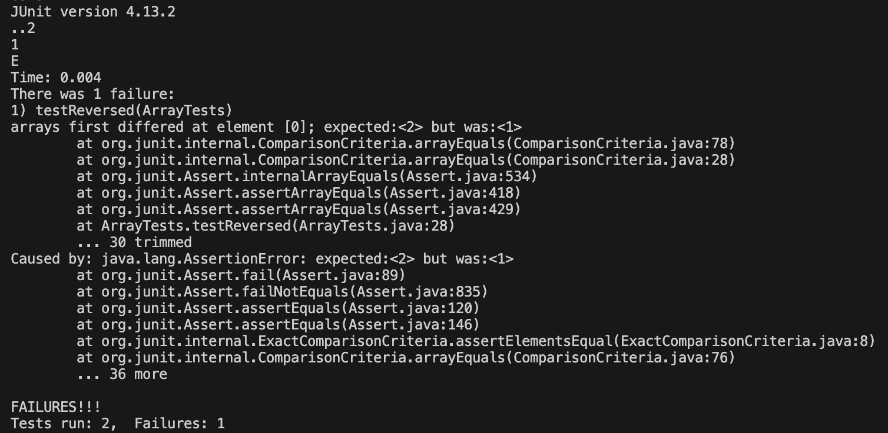

## Lab Report 3
### Part 1: Bugs

failure-inducing input:
```java
int[] input1 = {1, 2};
int[] input1_expected = {2, 1};
assertArrayEquals(input1_expected, ArrayExamples.reversed(input1));
```

input that doesn't induce failure:
```java
int[] input2 = {1, 2, 3, 4};
int[] input2_expected = {4, 3, 2, 1};
assertArrayEquals(input2_expected, ArrayExamples.reversed(input2));
```
The symptom as an output:


The Bug before:
```java
  static int[] reversed(int[] arr) {
    int[] newArray = new int[arr.length];
    for(int i = 0; i < arr.length; i += 1) {
      newArray[i] = arr[arr.length - i - 1];
      System.out.println(newArray[i]);
    }
    return arr;
  }
```

The Bug after:
```java
  static int[] reversed(int[] arr) {
    int[] newArray = new int[arr.length];
    for(int i = 0; i < arr.length; i += 1) {
      newArray[i] = arr[arr.length - i - 1];
      System.out.println(newArray[i]);
    }
    return newArray;
  }
```

Briefly describe why the fix addresses the issue:

Prior to fixing the bug, `reversed()` was returning the array that was being inputted. After changing what is being returned from `arr` to `newArray`, this method now returns a new array with the elements in reverse order.


### Part 2: Researching Commands
command-line options for `find`

1. Using -empty
  ```
  
  
  ```
2. Using
3. Using
4. Using
5. Using
