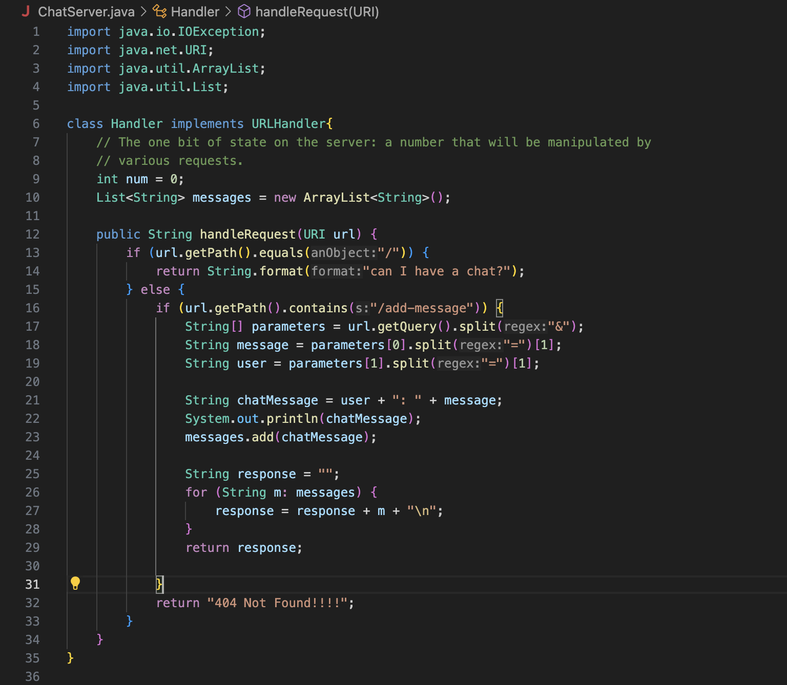
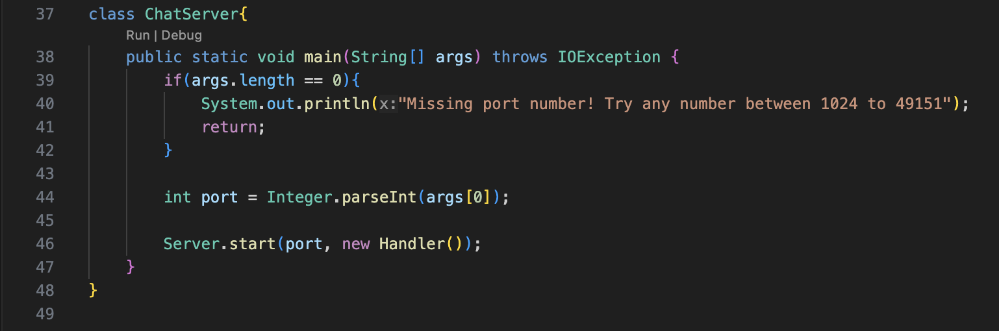
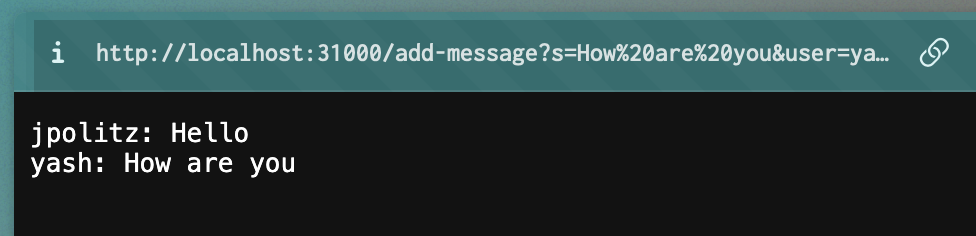

## Lab Report 2
### Part 1:
Code for `ChatServer`:
 
 

Using `/add-message`:

This 

### 2. Part 2:
Showing with `ls`:

### Part 3:
Describing something I learned:

Week 3's lab helped me take the things that I learned from previous coding classes and implement them into web servers. I've never handled requests before, so I found the process of taking apart each segment of the request and making sure that everything I wanted to see was being shown on the server very fascinating. Although I had alot of trouble starting, I was extra excited when everything was finally working. 

