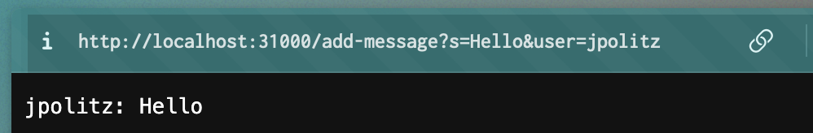

## Lab Report 2
### Part 1:
Code for `ChatServer`:
 
 

Using `/add-message`:

The methods that were called here were `handleRequest()` since it's the method that is called to handle the URLs. The relevant argument for this method is the request that is being passed in. Inside this method, `getpath()` and `contains()` are called to asses if this request contains `"add-message"`, which is the relevant argument for these methods. The methods `println()` and `add()`, where the relevant arguments are both `chatMesage`, which contains the name of the user and their message, were also called to print out the message that was sent by jpolitz and add it into the arraylist. The values that change at each request are `user` and `message`. Each value depends on who is sending the message and what the message is saying. In this case, jpolitz said "Hello".

The methods that were called here were `handleRequest()` since it's the method that is called to handle the URLs. The relevant argument for this method is the request that is being passed in. Inside this method, `getpath()` and `contains()` are called to asses if this request contains `"add-message"`, which is the relevant argument for these methods. The methods `println()` and `add()`, where the relevant arguments are both `chatMesage`, which contains the name of the user and their message, were also called to print out the message that was sent by yash and add it into the arraylist. The values that change at each request are `user` and `message`. Each value depends on who is sending the message and what the message is saying. In this case, yash asked "How are you".

### 2. Part 2:
Showing with `ls`:

### Part 3:
Describing something I learned:

Week 3's lab helped me take the things that I learned from previous coding classes and implement them into web servers. I've never handled requests before, so I found the process of taking apart each segment of the request and making sure that everything I wanted to see was being shown on the server very fascinating. Although I had alot of trouble starting, I was extra excited when everything was finally working. 

